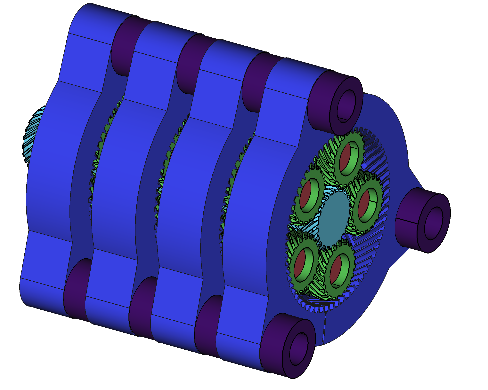

# 3D Printed Gearbox

This is one of my longest-lived projects and I am still working on it.
The main purpose of this project is to design and 3D print a gearbox for a robot.
The main reasons why I decided to work on this project were that I couldn't afford to buy a gearbox for the motors I was using and that I wanted to learn more about 3D printing small mechanisms.
I chose to design a planetary gearbox since it naturally keeps the gears aligned and can achieve large reduction ratios in small packages.

The main constraint on the design of the gearbox was its overall size: the largest allowed size of the gearbox was about *100mm x 60mm x 60mm* (about the size of a fist).
This meant that the individual gears should be rather small because the overall size of the gearbox also includes the housing and mounting points for the gearbox.
At the end, the individual planet gears resulted smaller than *10mm* in diameter with teeth about *0.5mm* in width.
These small sizes were hard to 3D print because the smallest feature my 3D printer is able to produce is about *0.3mm*.
Small print errors were enough to make the gears unusable.

I ended doing many iterations in order to get the parameters of the gears and of my 3D printer right.
However, at the end I was able to create a working gearbox which worked perfectly with my robot.

This is a computer model of the gearbox.
It only contains the internal components of the gear (the housing is not shown).

This table contains the main components of the gearbox:

| Name                     |  Image                      |
|--------------------------|-----------------------------|
| Planet Gear              | ![Image][Planet Gear]       |
| Sun Gear                 | ![Image][Sun Gear]          |
| Ring Gear                | ![Image][Ring Gear]         |
| Carrier                  | ![Image][Carrier]           |

<!-- TODO: Talk about chamfers on gear teeth in order to improve meshing by reducing printing errors -->

And these are pictures of the current status of the actual 3D printed gearbox.
In order to reduce noise and friction between the individual gears I used white lithium grease to lubricate the gears.
In the lower stages (the ones closer to the motor) the grease is not that effective since the gears are moving too fast.
However, in the higher stages (the stages closer to the output of the gearbox) the grease is quite effective.
Lubrication is another problem that I plan to fix in future versions of the gearbox.

| Name                              |  Image                             |
|-----------------------------------|------------------------------------|
| Printed Gearbox with enclosure    | ![Image][Printed Gearbox]          |
| Stages of the gearbox             | ![Image][Printed Gearbox Front2]   |
| Stages and enclosure fit          | ![Image][Printed Gearbox Fit]      |
| Output stage of the gearbox       | ![Image][Printed Gearbox Front1]   |

<!-- TODO: Add more stuff about the printed gearbox-->
<!-- TODO: Add videos of the robot working with the printed gearbox-->

[Sun Gear]: ./images/Sun.png
[Planet Gear]: ./images/Planet.png
[Ring Gear]: ./images/Ring.png
[Carrier]: ./images/Carrier.png
[Stage1]: ./images/Stage1.png
[Stage2]: ./images/Stage2.png

[Printed Gearbox]: ./images/PrintedGearbox.jpg
[Printed Gearbox Fit]: ./images/PrintedGearFit.jpg
[Printed Gearbox Front1]: ./images/PrintedGearFront1.jpg
[Printed Gearbox Front2]: ./images/PrintedGearFront2.jpg
